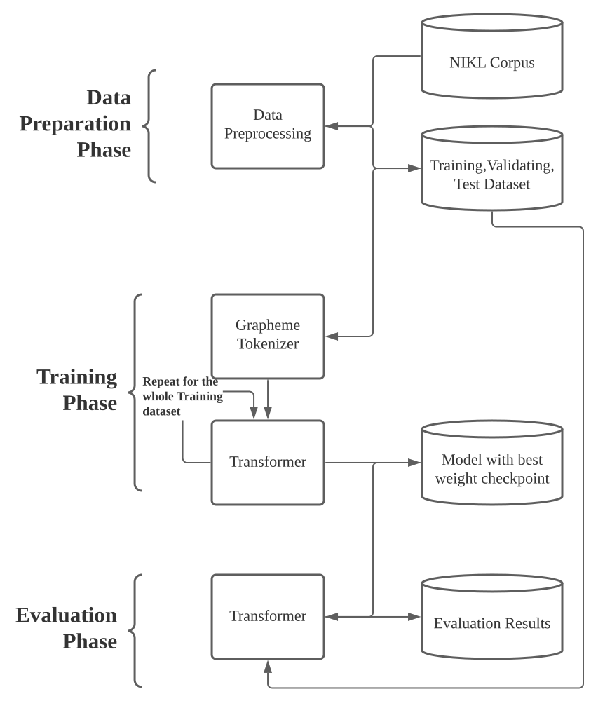

<!--
Copyright 2020 Google LLC

Licensed under the Apache License, Version 2.0 (the "License");
you may not use this file except in compliance with the License.
You may obtain a copy of the License at

     https://www.apache.org/licenses/LICENSE-2.0

Unless required by applicable law or agreed to in writing, software
distributed under the License is distributed on an "AS IS" BASIS,
WITHOUT WARRANTIES OR CONDITIONS OF ANY KIND, either express or implied.
See the License for the specific language governing permissions and
limitations under the License.
-->

# TKOrrector

Transformer Based Korean Sentence Spacing Corrector

## License Summary

This solution is made available under Apache 2 license. See the LICENSE file.

## Minimum Requirements  

It is recommended that you run the Trainig on a machine with Nvidia GPU with drivers and CUDA installed.  

## Prerequisites

1. Clone this repo and cd into it.  

2. Install dependencies. Preferrably in a virtual env.

    a. Optional:  Create new virtual env. Conda example below.  
    `conda create --name TKOrrector python=3.9 -y`  
    `conda activate TKOrrector`

    b. Install PyTorch with CUDA
    `conda install pytorch torchvision torchaudio cudatoolkit=11.1 -c pytorch -c nvidia`

    or  

    b. Install PyTorch without GPU
    `conda install pytorch torchvision torchaudio cpuonly -c pytorch`

    c. Install dependencies  
    `pip install -r requirements.txt`

## Run  

You can run the pretrained model without the need to Train.  

1. Download [the pretrained model](https://storage.googleapis.com/paulsandbox_asia/TKOrrector/TKOrrector.tar.gz) and extract into the current directory (`tar zxvf TKOrrector.tar.gz`)

2. `sh demo.sh`  

OR

1. Run a pre-packaged container with pretrained model already downloaded.  
   
2. docker run -it paulhkim80/tkorrector:0.1

Example demo run screen and results.  

## Train  

### Download the Corpus  

1. Go to [NIKL Corpus Download Site](https://corpus.korean.go.kr/request/corpusRegist.do#down) and apply for a new license.  

   The cost is free but you need to sign an agreement.  It is recommended that you upload the corpus file on an object storage such as [GCS](https://cloud.google.com/storage) to quickly download on additional machines such as GCP GCE to use a VM with GPU for training as needed without huge upfront cost.  Edit src/download_corpus.sh to download the Corpus file and expand it into the designated directory.  

    `cd src`  
    `sh download_corpus.sh`  

### Run the data prep stage  

    Change lines 51, 53 in prepare_corpus_with_tokenizer.sh to increase the training dataset size.  
    The second argument is the number of files to include into the training set + 1.  
    `get_corpus "../data/$CORPUS1/*" 10`  
    Above command would include 9 files (manual pdf file is skipped) from the Newspaper corpus.

1. Run the data prep command.  

   `sh prepare_corpus_with_tokenizer.sh`

### Run the training stage  

1. Run the training command.  

   `sh train.sh`  

### Run the Evaluation  

1. After the training is done, evaluation of the model with test dataset can be performed with batch translations by running the command below.  

   `sh calculate_metrics.sh`  

## Detailed Dataflow Diagram  

